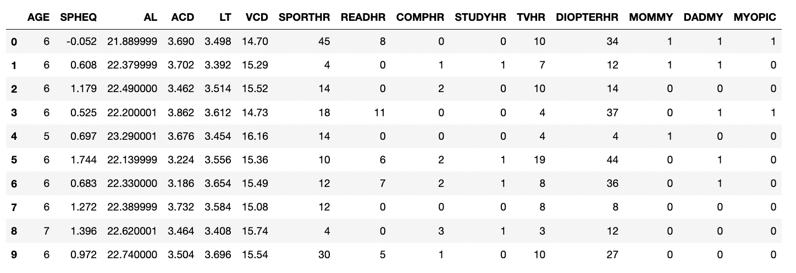

## Myopic Patient Data

Classify Myopia Patient Data using Unsupervised Machine Learning Models

## Objectives

### Step 1 - Prepare the Data

* Read myopia.csv into a Pandas DataFrame

* Remove the "MYOPIC" column from the dataset

* Standardize the dataset so that columns that contain larger values do not influence the outcome more than columns with smaller values

* Sample Analysis: After examining the initial dataset, there are 15 features present in the data. After removing the "MYOPIC" column from the dataset, there are 14 features.

### Step 2 - Apply Dimensionality Reduction

* Perform dimensionality reduction with PCA

* Sample Analysis: After performing dimensionality reduction with PCA, there are 10 features in the data. According to the explained variance, we have 92% of the information in the original dataset which is over the desired 90% explained variance.

* Further reduce the dataset dimensions with t-SNE
* Create a scatter plot of the t-SNE output

* Sample Analysis: After performing dimensionality reduction with T-SNE, there are five clusters that can be identified.

### Step 3 - Perform a Cluster Analysis with K-means

* Create a K-means model

* Create an elbow plot to identify the best number of clusters

### Step 4 - Make a Recommendation

* Recommendation: The lowest elbow of the plot occurs at k = 5, indicating that the best number of clusters for the given data is 5. Therefore, it is recommended that the patients be grouped into five clusters.

---------------------------------------------------

<b>Contact:</b> bronwynmilne64@gmail.com
